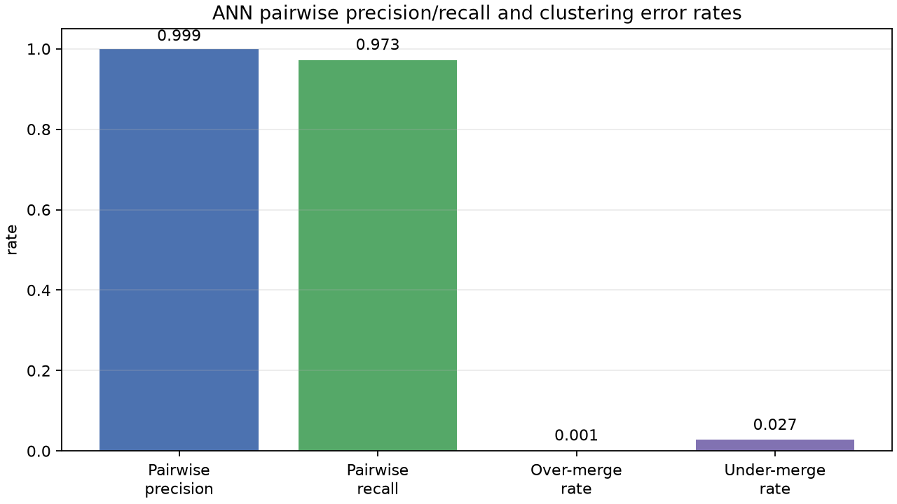
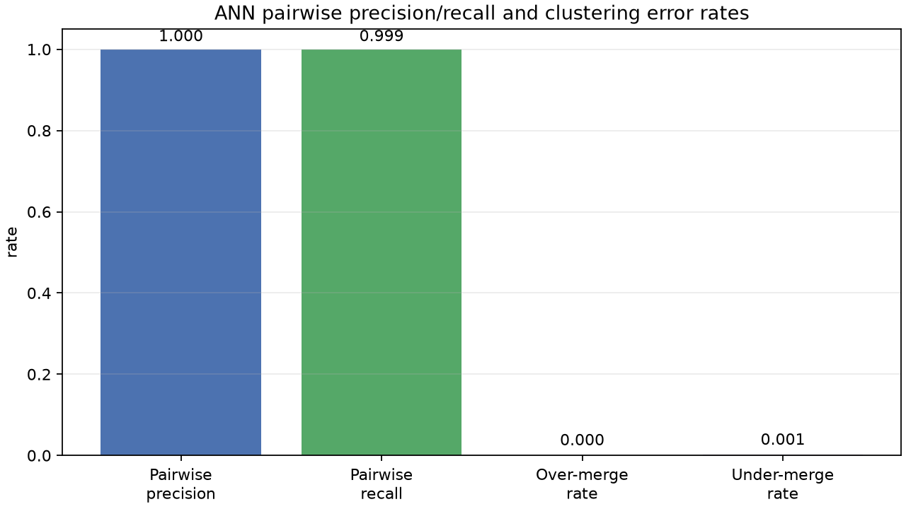
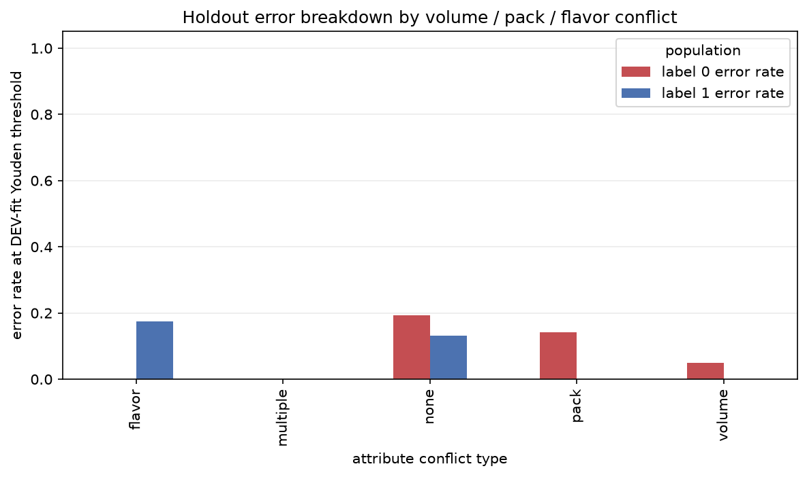
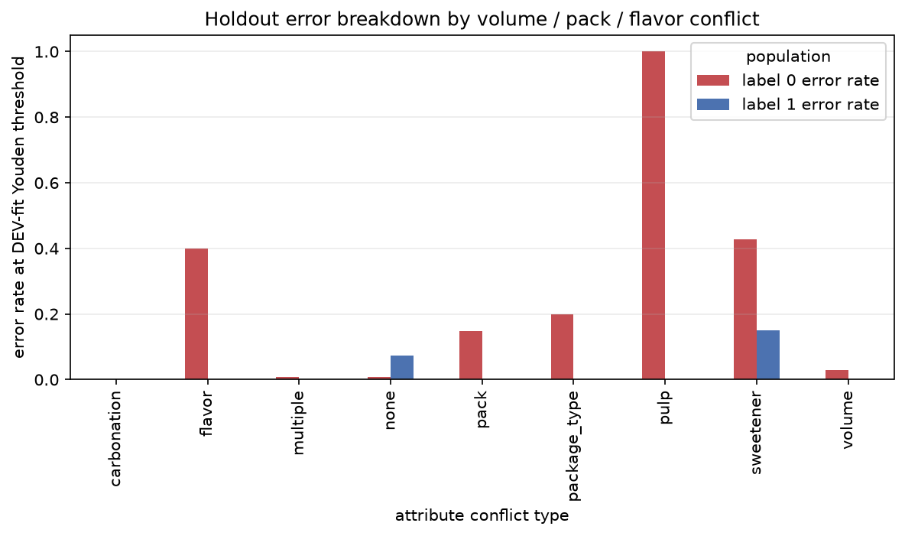
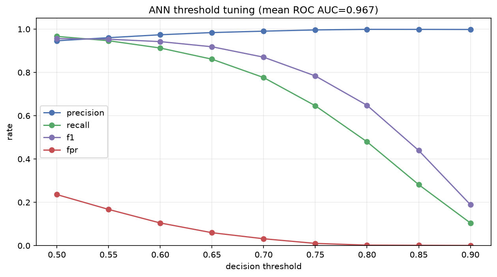
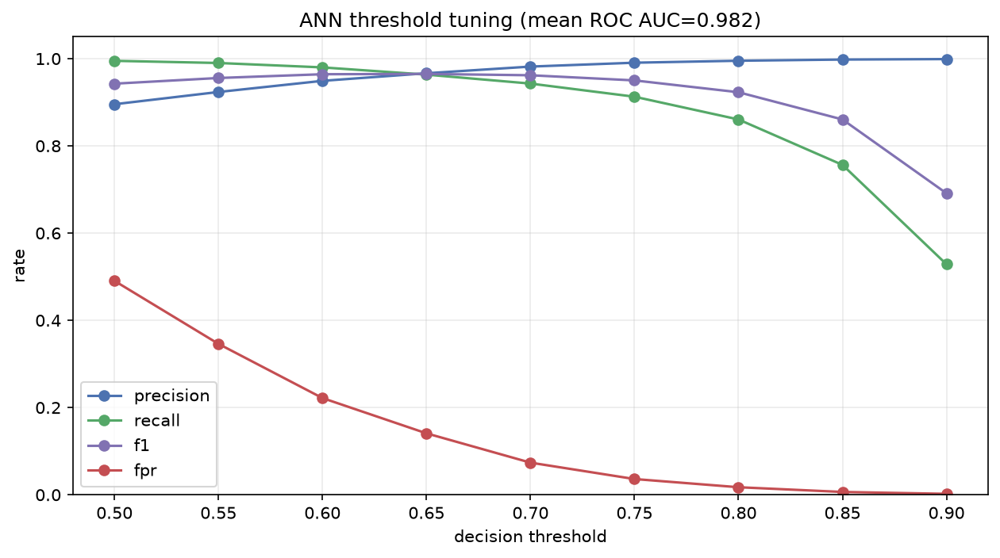

# ANN Error Analysis: Previous Run → Latest Run

Validation set: 3,000 SKUs. The comparison uses the same validation split so
the change is attributable to the latest full-dataset run.

## Pairwise and clustering quality

Previous run (`0915T075044186132Z`):

Latest run (`0916T082923217621Z`):

## Error rate by attribute

Previous run (`0915T075044186132Z`):

Latest run (`0916T082923217621Z`):

## AUC threshold tuning

Previous run (`0915T075044186132Z`):

Latest run (`0916T082923217621Z`):

Previous run: adjusted Rand `0.9856`, pair recall `0.9725`, pair precision
`0.9991`, over-merge `0.09%`, under-merge `2.75%`.

Latest run: adjusted Rand `0.9993`, pair recall `0.9987`, pair precision
`1.0000`, over-merge `0%`, under-merge `0.13%`.

## ANN error GTIN strata

| GTIN stratum | n | Who decides? |
|---|---:|---|
| `both_equal` | 2,915 | GTIN gate (score irrelevant) |
| `different` | 13 | GTIN gate (score irrelevant) |
| `one_missing` | 0 | — |
| `both_missing` | 0 | — |

## Acceptance criteria

- Preserve `over-merge rate = 0%`.
- Do not lower the global decision threshold to obtain recall.
