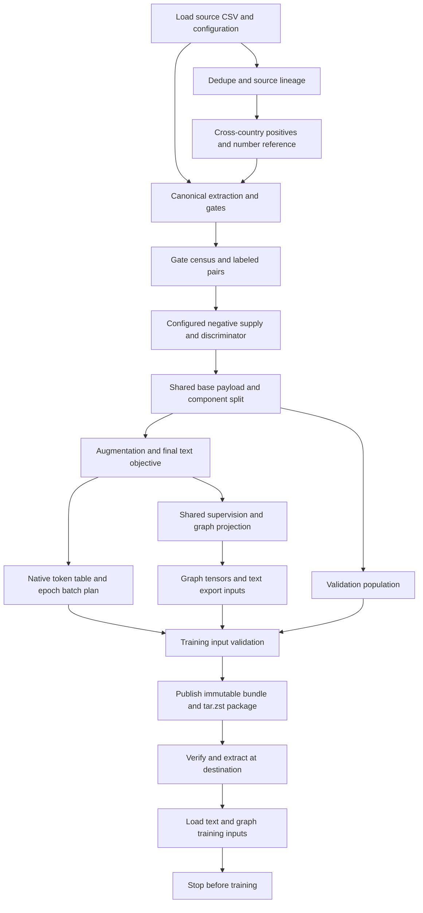

# CSV → training-ready inputs: pipeline design

Status: implementation in progress. This document defines the target contract;
existing partial changes are not evidence that the whole contract is finished.

## One invocation, one owner

`TrainingPreparation` is the Pydantic owner of one run. It resolves configuration,
loads source data, runs producers in the same Python interpreter, retains shared
objects, publishes artifacts, and hands the final objects to input validation.
The local preparation process stops after training inputs have been loaded and
validated; it does not execute an optimizer step.

The class coordinates existing domain functions rather than duplicating their
algorithms. Small typed models describe stage dependencies, artifacts, state,
and timings. Large dataframes, arrays, tokenizers and payloads stay in private
runtime fields rather than being serialized into Pydantic JSON.

A single command drives the lifecycle. Individual producer CLIs remain useful
for debugging, but the main pipeline does not start another Python interpreter
for each stage or reload an artifact it already owns in memory.

## Configuration is the source of truth

- `config/paths.yaml`: CSV locations, column names, dataset contract.
- `config/training.yaml`: extraction/training policy, minting, augmentation,
  split, sampling and training-plan parameters.
- Existing vocabulary and identity configuration: semantic extraction rules.
- `config/model_tracks.yaml`: participating tracks, checkpoint, suite paths,
  packaging format and executed track settings.

Capture effective configuration at run entry. The run owns its generated census;
if the existing census pin must be published to training.yaml, update the active
validated view at that boundary. It must not leave an earlier imported value in
use. Measured output fields do not invalidate their own producer.

## Dependency order

Preserve existing data semantics: the raw-export canonical/gating contract and
the deduped training catalog are distinct views of one source, not interchangeable
CSVs. Labels, split membership, augmentation lineage and token alignment must
remain consistent when removing repeated work.

Graph preparation should consume the final shared objective. Avoid constructing
one graph population only to replace it during packaging. Native tokenization,
checkpoint loading, composed text, split calculation and base pair construction
should each occur once for the same inputs within the run.

## In-memory state and rebuilds

Within an invocation:

- Load the source once; derive projected and renamed views from that frame.
- Keep one shared base payload; isolate mutations by consumers that augment it.
- Keep the validated prepared bundle for graph projection, diet checks,
  preflight and handoff. Do not decompress it separately for each consumer.
- Share the tokenizer and token table between baseline, export and ablation
  preparation where their exact tokenizer/text contracts agree.
- Invalidate run-owned objects explicitly when their producer replaces an input.
- Discard all runtime state on success or failure. Do not retain a process-global
  boolean that claims future configurations and files were already validated.

Between invocations:

Always start again from the CSV and current configuration. There is no automatic
stage reuse, content-addressed stage store or selective rebuild plan. Each fresh
invocation discards all runtime state from the previous invocation, rebuilds the
artifacts, and publishes a new complete generation. Existing explicit resume
entrypoints are legacy recovery tools, not the normal execution path.

Efficiency comes from doing each piece of work once per run, sharing objects,
avoiding duplicated projections/tokenization, and fast serialization/transport.
It does not depend on proving a previous run's cached stage is still valid.

## Expected changes

Regex, negative minting, feature extraction, numeric augmentation, vocabulary,
masking, split policy, tokenizer and epoch-plan changes all take the same route:
restart the complete pipeline with the edited source/configuration. Rebuild
structured features together with changed numeric text; preserve augmentation
lineage and component holdout semantics. There is no invalidation matrix for the
user to maintain and no special fast path to select after error analysis.

## Packaging and transport

Use configured `tar.zst` for new input packages; retain ZIP reading for older
artifacts. Benchmark against the existing data before reporting a speedup.

- Stream tar verification directly from the Zstandard decoder.
- When extraction or random access is required, open/inflate once and retain
  that reader through validation and use.
- Include each configured bundle once, even with a custom filename.
- Do not recompress an already-compressed input package in its transport wrapper.
- Preserve atomic publication, inventories, traversal protection and rejection
  of corrupt, duplicate or undeclared members.
- Use copy-on-write clones when a separate bundle path is required; ordinary
  copies remain the portable fallback. Never alias writable files with hard links.
- Every archive reader in the handoff path must support the configured format;
  renaming a ZIP file to `.tar.zst` is not format conversion.

Changing the inner text-bundle serialization is a separate, measured decision:
retain compatibility until writer, loader, token-repair tools and packaging all
understand the new format.

## Training input boundary

Validation is owned by the producer/run and its typed output contracts, then by
the consumer at a new process or machine boundary. A run-local validated object
can be passed directly to the next stage. An imported archive must be checked
before its contents are executed or installed.

Check source lineage, pair uniqueness/label domain, component disjointness,
augmentation provenance and numeric feature agreement, shared objective identity,
graph projection/tensor alignment, native token policy, and frozen epoch coverage.
Use the actual worker configuration rather than a similar preparation template.

The text worker must not unpickle the full bundle just to obtain a header before
the trainer unpickles it again. The graph worker must load the final prepared
arrays and split pairs. GPU-only embeddings are an explicit prerequisite: they
may be declared pending during CPU preparation, but must exist before the hybrid
trainer is reported ready. A CPU validation run can check the loaded data contract
without claiming CUDA execution was exercised.

Completion means all declared artifacts exist, the package is usable by the
consumer, and each requested training input path is loadable. Archive creation
alone is not completion. No optimizer step is part of this scope.

## Build order and evidence

1. Establish the run owner and import-safe stage functions; remove per-stage
   Python subprocesses and refresh generated configuration at its owning boundary.
2. Share source/base/bundle objects; move repeated diet/preflight work onto them.
3. Ensure every new invocation starts clean and run-owned state is cleared on failure.
4. Complete tar.zst writer/reader/transport integration and remove duplicate copies.
5. Connect the actual training-load boundary; retain failure and timing reports.
6. Run representative complete builds before and after edits. Compare outputs
   and record elapsed time, serialization/load counts and artifact sizes.

Implementation comes first. Use direct executions and targeted checks as changes
land; do not make a new test suite a prerequisite to building the pipeline.

Record unresolved work explicitly: changes interrupted mid-refactor, unavailable
GPU prerequisites, stale pre-existing bundles, and unmeasured performance must not
be presented as completed or validated.
